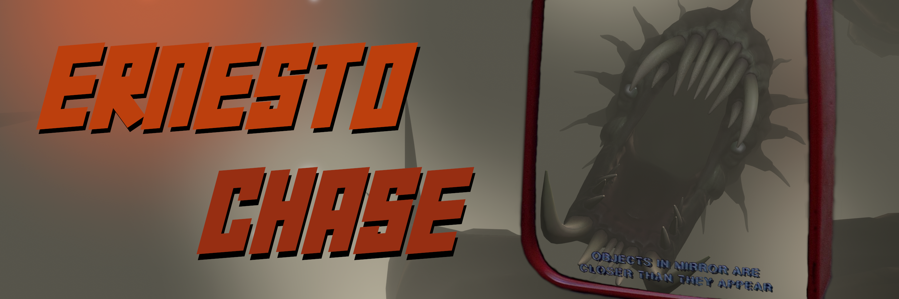

Is Outer Wilds too easy? Is the time loop not stressful enough? Then look no further, for this mod may be the solution!

The Dark Bramble hive mind has recently employed it's newest Time Assassin, Ernesto, to hunt you down. Equipped with a handheld portal gun and his very own phase inducer, letting him pass through solid objects, this anglerfish is going to stop at nothing to find you. Escape is impossible, and it's only a matter of time before you're caught. How long can you survive?

## Gameplay Suggestions

If you find yourself bored of the Outer Wilds solar system, try throwing in some story mods. Ernesto should be able to hunt you in any solar system you travel to.

Some suggestions for challenges:
- Set Ernesto's speed to max (very difficult)
- Beat Permadeath Mode
- Complete story mods
- Beat Outer Relics
- Enable stealth mode (jumpscare warning)

Sadly, this mod does not work in multiplayer. How is Ernesto going to chase two hatchlings at once?

## Settings Descriptions
- **Ground Movement Speed** - Controls how fast Ernesto moves while in a gravity field.
- **Space Acceleration Type** - Changes how Ernesto accelerates towards you in space.
	- **Timed**: The recommended option. Regardless of how fast you're moving through space, Ernesto will reach you in a fixed amount of time, which is controlled by the Interception Time.
	- **Linear**: Regardless of how fast you're moving through space, Ernesto will get closer to you at a constant rate, which is controlled by the Space Acceleration Speed.
	- **Cumulative**: Ernesto gains speed over time and eventually catches up to you. His movement is very unpredictable, and he may keep missing your ship. His acceleration is controlled by the Space Acceleration Speed.
- **Space Acceleration Speed** - Changes Ernesto's speed in space when the Space Acceleration Type is either Linear or Cumulative.
- **Interception Time** - Used when the Space Acceleration Type is set to Timed. Changes how long it takes for Ernesto to reach you in space.
- **Dark Bramble Speed Multiplier** - Multiplies Ernesto's speed by this value when he is in a Dark Bramble seed. This may have unexpected results when playing with story mods, as some use Dark Bramble seeds for a new dimension. If Ernesto is changing speed when he shouldn't be, set this multiplier to 1.
- **DW Speed Multiplier** - Requires the DLC. Multiplies Ernesto's speed by this value when he is in a certain dreamy place.
- **Start Delay** - The number of seconds to wait before spawning and chasing you. This may need to be adjusted if you are using other mods.
- **Enable Stealth Mode** - JUMPSCARE WARNING; Turns off Ernesto's audio and light. He will make no sound until he is about to reach you.